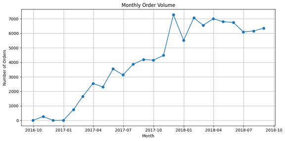
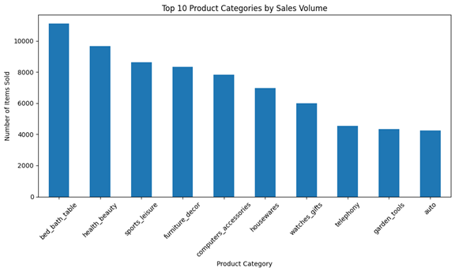
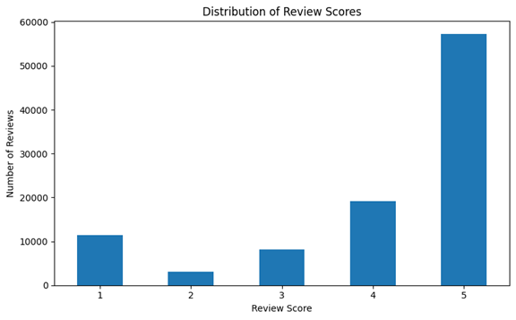
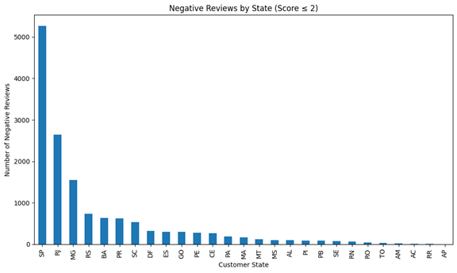

# Customer Behavior Analysis on Brazilian E-Commerce 

## Project Overview
This project analyzes customer behavior in Brazilian e-commerce using the Olist dataset. It focuses on customer orders, product category preferences, and customer satisfaction levels.

## Dataset Source
The dataset is provided by [Kaggle - Olist Brazilian E-Commerce](https://www.kaggle.com/datasets/olistbr/brazilian-ecommerce), including:
- Orders and items
- Customers and locations
- Product categories
- Reviews and payments

---

## 1. Customer Purchase Behavior

We analyzed order volume across states and over time.

- SP, RJ, and MG are the top states by number of orders.
- The monthly order volume shows rapid growth in late 2017 with stable performance in 2018.

---

## 2. Product Preference Analysis

We examined which product categories are most popular and which received the lowest average reviews.

- `bed_bath_table`, `health_beauty`, and `sports_leisure` were the top-selling categories.

---

## 3. Customer Satisfaction

We explored the distribution of customer review scores and where negative reviews are concentrated.

- Most reviews are positive: over 50% of reviews gave a score of 5.
- Negative reviews (score ≤ 2) are more common in the most active states like SP and RJ.

---

## Key Findings

- Customer activity is highly concentrated in the Southeast region of Brazil.
- The most popular product categories are also the most criticized, indicating high exposure, not necessarily poor quality.
- Despite occasional delays and complaints, the majority of customers left high ratings, suggesting strong overall satisfaction.

*Note: High number of negative reviews in top categories is likely due to their overall high sales volume, not necessarily poor product quality.*
